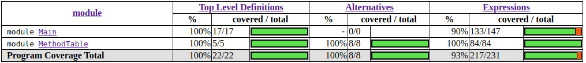

# OOPMethodTable
Simple OOP method manager in haskell

To use, run the makefile and you will get two executables, one to interact with the method manager and another with the tests

To generate the coverage test data, execute Tests and then do:

`$ hpc markup Tests`

This will generate some html files with all the information

